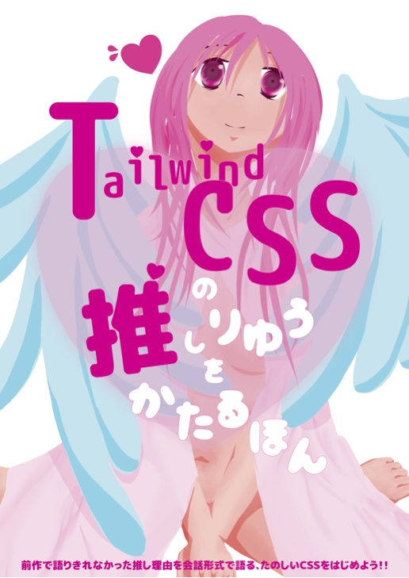

### 👋 Hello, I'm Hirotaka Koga (kght6123/げぐはつ書房) 👋

Front-end Engineer | React.js/Next.js | Tailwind CSS Enthusiast

#### 👶 About Me

I am a father of two who enjoys web front-end development. Recently, I've been mainly using TypeScript, React, Next.js, Tailwind CSS, etc.

I'll be working an average of 1-3 hours a day, but I'm looking for a repository where I can improve my skills or contribute as a side job. (as of 2024)

#### 🛠️ Skills

This is a level where you can read code and develop common components and applications.

- React.js/Next.js
- Vue.js/Nuxt.js: Vue.js 2.x, Nuxt.js 2.x only. 
- jQuery/Bootstrap/jQuery UI

I am very knowledgeable about Tailwind CSS.

#### 📘 Doujinshi (Self-Published Book)

I'm currently writing a doujinshi about Tailwind CSS!

|  |  |  |
|:-------------------:|:-------------------:|:-------------------:|
| [Booth](https://kght6123.booth.pm/items/3039023) [Amazon](https://kdp.amazon.co.jp/amazon-dp-action/jp/dualbookshelf.marketplacelink/B0BFHZG1QK) | [Booth](https://kght6123.booth.pm/items/4151967) [Amazon](https://kdp.amazon.co.jp/amazon-dp-action/jp/dualbookshelf.marketplacelink/B0BF34MLL9) | [Booth](https://kght6123.booth.pm/items/4485386) |

You can find more details and purchase it [here](https://kght6123.booth.pm).

### 📫 Contact

- Twitter: https://twitter.com/kght6123
- GitHub: https://github.com/kght6123

Feel free to reach out for inquiries or collaboration opportunities!

---

Detailed work history and information regarding output can be found on [My Portfolio Site (Japanese)](https://kght6123-work.pages.dev).
